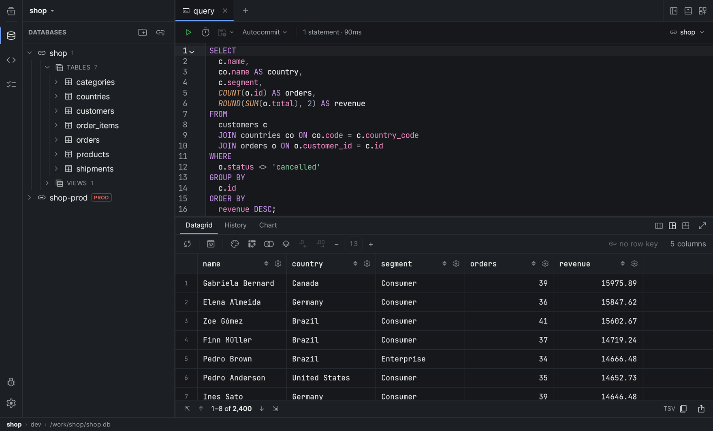
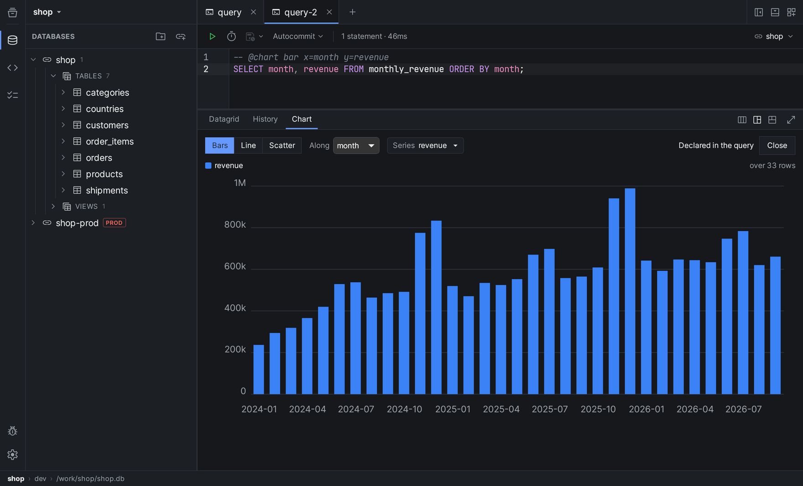
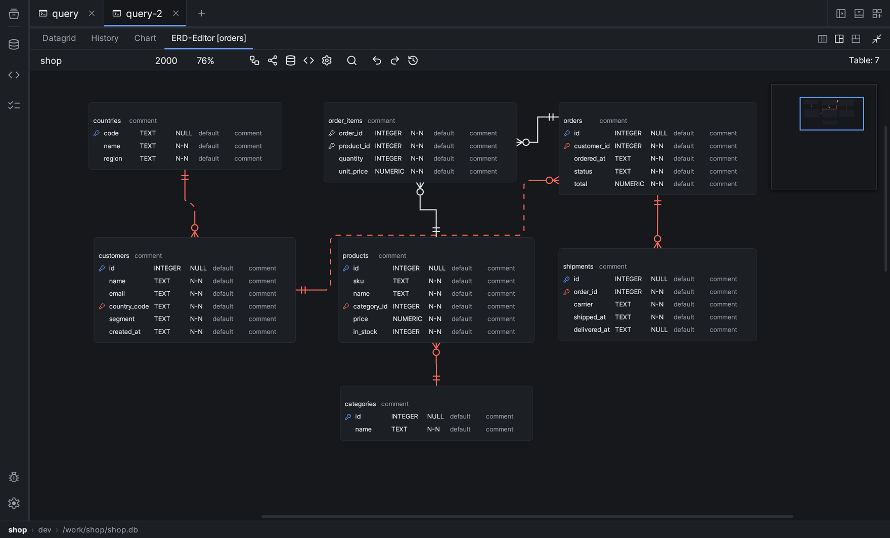
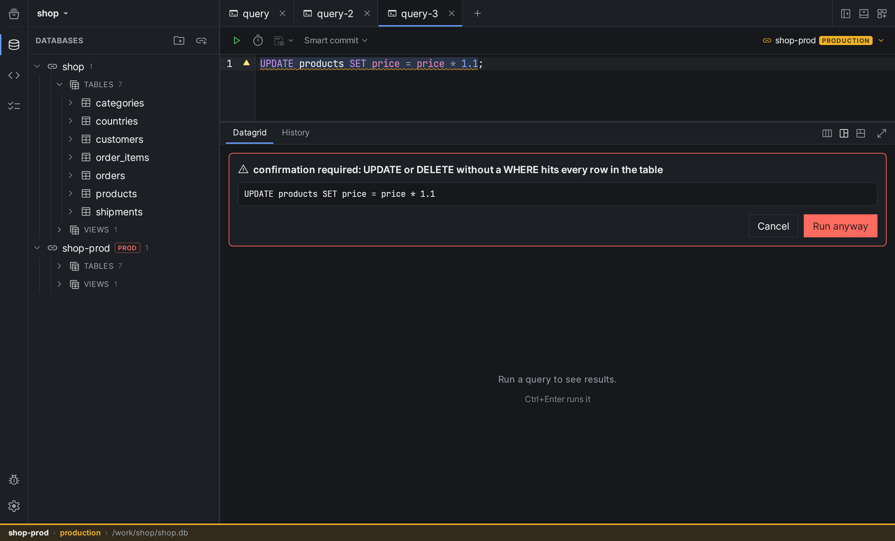
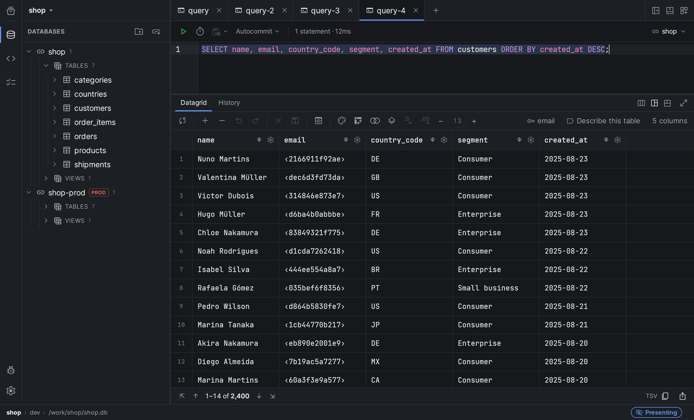

  <picture>
    <source media="(prefers-color-scheme: dark)" srcset="assets/bando-mark-dark.svg">
    
  </picture>

<h1 align="center">Bando · Data Workspace</h1>

  A fast, native app: connect to your databases, write SQL, and keep working with the answer —
  filter it, join it, chart it, report on it, and hand it to an AI that asks before it writes.

  <a href="../../releases"><strong>Download</strong></a> ·
  <a href="#what-it-does">What it does</a> ·
  <a href="#databases">Databases</a> ·
  <a href="#your-data-stays-yours">Privacy</a> ·
  <a href="../../issues">Report a problem</a>

  

---

## Why Bando

**A native app, not a browser in a box.** The core is Rust and the window is
Tauri, so Bando starts like a tool and not like a server. Measured on Apple
Silicon: **a painted window in 0.4 s** and **about 100 MB of memory at rest**.
A million rows materialize in **a quarter of a second with a 31 MB peak**,
because a large result spills to disk instead of growing in memory.

**A result is a dataset, not a dead table.** Filter, sort and aggregate it
right there, without another trip to the server. Join two results — from two
different databases, or against a CSV, JSON or Parquet file — on your machine,
without moving data from one connection to the other. Export to CSV, JSON,
Parquet or Excel, streamed straight to disk.

**Hard to hurt production by accident.** Mark a connection `prod` and every
write asks first. Mark it read-only and the core refuses `DROP`, `DELETE` and
friends before they reach the driver — the same rule stops a `FLUSHALL` on
Redis. An `UPDATE` or `DELETE` without `WHERE` always asks, whatever the
environment. **Stop** cancels on the server, not just in the window. And an
open transaction stays on screen until you commit or roll it back; closing the
tab does not quietly forget it.

**AI as an operator, on your terms.** Bring your own model: Anthropic,
OpenRouter, any OpenAI-compatible endpoint, or a local model through
**Ollama, with no key and nothing leaving your machine**. The assistant works
over your real schema, starts read-only, and asks you — per action — before
anything writes. Every session runs under a token and cost budget you set.

## What it does

<table>
  <tr>
    <td width="50%"> <b>Charts</b> — offered by the result's shape, written into the query.</td>
    <td width="50%"> <b>Schema diagram</b> — every table, key and relation.</td>
  </tr>
  <tr>
    <td width="50%"> <b>Production</b> — an UPDATE without WHERE stops and asks.</td>
    <td width="50%"> <b>Presentation mode</b> — personal data masked before you share.</td>
  </tr>
</table>

| Feature | What you get |
| --- | --- |
| **SQL editor** | Autocomplete ranked by your foreign keys, formatting per dialect, errors marked in the gutter, `:named` variables resolved before anything is sent. |
| **Fast grid** | Drawn on canvas, scrolls through millions of rows. Edit a cell on a table with a primary key: the SQL is shown for review before it runs. |
| **Charts** | A Chart tab appears when the result has a chart's shape, and a builder writes the chart into the query, so it reruns with it. |
| **Schema diagram** | Your tables and their relations as an interactive ERD. |
| **Reports** | Plain text files with typed parameters that live in Git and run without the window (`bando report run`). Out come HTML ready to print, Markdown or an Excel workbook, charts included. |
| **History** | Every run is kept, and any of them goes back into the editor — as its own query, as the script it came from, or into the tab in front. |
| **Views and routines** | Edit a definition in its own tab and apply it after a side-by-side review against what is on the server now. |
| **Presentation mode** | Masks personal data — e-mails, phone and card numbers, CPF and CNPJ, credentials, and any column you name — in the grid, copies, exports, reports and the assistant, before you share your screen. |
| **MCP, both ways** | `bando mcp serve` gives your own agent read-only tools on one connection. Other MCP servers plug into Bando's assistant, each approved by the command line it runs. |
| **Projects** | A project is a folder. Connection definitions and scripts can go into Git; passwords and history stay on your machine. |
| **Connectivity** | SSH tunnels through your own `ssh` and its config, TLS, client certificates. |
| **Your look** | VS Code color themes, imported as they are. English and Portuguese (Brazil). |

## Databases

**PostgreSQL · MySQL · SQLite · SQL Server · MongoDB · Redis** — each with a
native Rust driver, all held to the same conformance tests.

Also verified against a live server: **MariaDB, TimescaleDB, TiDB,
YugabyteDB, libSQL, Valkey, KeyDB and Dragonfly.**

MongoDB and Redis are not SQL, so their results are read and run rather than
paged, counted or edited in the grid — and Redis can only stop a script or a
blocked client mid-run, not most commands.

## Your data stays yours

- **No telemetry.** No usage counters, no crash uploads — there is nowhere for
  them to go.
- **Bando talks to your databases, the AI provider you chose, and this
  repository** — once per launch, to ask whether there is a newer version. You
  can switch that off.
- **Nothing about a connection reaches a model until you allow it for that
  connection** — the schema and the values are two separate permissions, and
  both start off.
- **Passwords stay out of what you share.** A project's connection definitions
  can go into Git; the passwords live in a separate local file that Bando keeps
  out of commits, and they never enter a connection string or the window.
- **Feedback leaves only through your own browser**, as an issue you read before
  you send it.

## Download

Get it from **[Releases](../../releases)**.

| System | File |
| --- | --- |
| macOS (Apple Silicon) | `.dmg` |
| Windows | `-setup.exe` |
| Linux (x86_64) | `.AppImage`, `.deb` or `.rpm` |

**There is no stable release yet.** Builds published before it are marked
*pre-release* and may not cover every system.

**The installers are not signed by the operating system yet.** macOS will say
the developer could not be verified — right-click › Open, once — and Windows
will show SmartScreen: More info › Run anyway. That is about the *first*
install; the signature updates are checked against is a different one, and it
already exists.

- **`.deb` and `.rpm` never update themselves.** The updater will not replace a
  package it did not install, so automatic updates on Linux mean the
  `.AppImage`.
- **Intel Macs have no build yet.**

## How updating works

Bando asks this repository, once per launch, whether a newer version shipped.
When one has, it says so in a toast with a button and **waits for you to say
yes**. It never replaces the application under somebody who is in the middle of
an open transaction against a production database.

The downloaded package is verified with
[minisign](https://jedisct1.github.io/minisign/) against a public key compiled
into the application. A tampered feed installs nothing: the signature is
checked before the first byte is written. The automatic check can be turned off
in Settings, and the *Check for updates* button stays either way.

## Problems

Open an [issue](../../issues). If Bando showed you an error ID — something like
`syntax_error-a1b2c3` — paste it in. It is what locates the problem, and it
carries nothing from your database.

---

This repository holds no code: it carries the installers, the update feed
and the issues.
